<div align="center">

# ROG Flow KDE Widgets

### Three native KDE Plasma 6 dashboards for the ASUS ROG Flow Z13

**System telemetry · Power and RGB controls · Steam Gaming Mode**

**CachyOS** · **KDE Plasma 6** · **ROG Flow Z13** · **MIT License**

</div>

> **Initial release: [v1.0.0](../../releases/tag/v1.0.0).** Tested on an ASUS ROG Flow Z13 running CachyOS, KDE Plasma 6, and a configured Gamescope session. This is an unofficial community project, not affiliated with ASUS or Valve.

## Three widgets. One desktop.

Turn your ROG Flow Z13 into a transparent, themeable desktop dashboard. Install any one widget or all three; each has independent settings and can be moved and resized using Plasma Edit Mode.

| Widget | What it does | Current source version |
| --- | --- | --- |
| **ROG System Widget** | CPU/GPU usage, RAM, battery, APU temperature, fan RPM, TDP, storage, network graph and active power profile | 1.3.0 |
| **ROG Control HUD** | Switch `z13ctl` performance profiles, view AC/battery autoswitch targets, control keyboard and lightbar RGB | 1.2.0 |
| **ROG Gaming HUD** | Steam Game Mode launcher, four Bluetooth controller slots with battery readings, recently played games, and power-profile selection | 1.4.0 |

### Desktop showcase

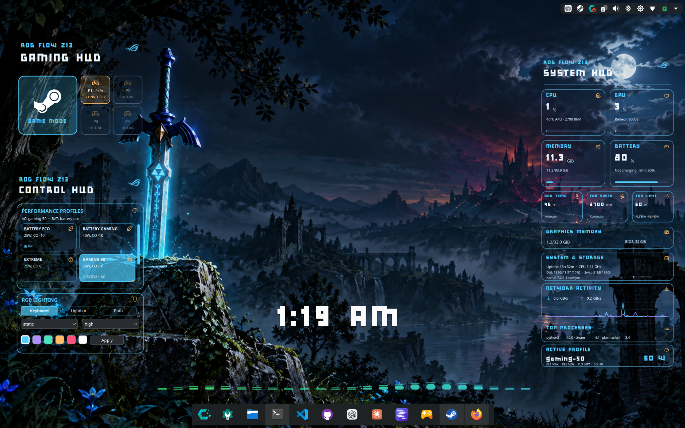

### Power Profile Management

Switch between battery-saving, gaming, and extreme-performance profiles using the ROG Control HUD, or select a launch profile directly from Gaming HUD before entering Steam Gaming Mode.

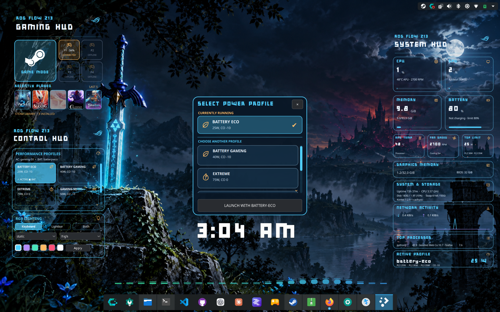

*The currently running profile is shown separately from the profile selected for launching Gaming Mode.*

## Quick install

### Recommended: download and run

Download the **[complete v1.0.0 bundle](../../releases/tag/v1.0.0)** with all three prebuilt widgets and a root-level `install.sh`:

1. Open [Releases](../../releases) and download the complete bundle.
2. Extract the ZIP.
3. Open a terminal inside the extracted folder and run:

```bash
bash install.sh
```

4. Open **KDE Plasma → Edit Mode → Add Widgets**, then search for **ROG System Widget**, **ROG Control HUD**, or **ROG Gaming HUD**.

The bundle installer offers all three widgets or an individual widget. **Run it from the extracted release ZIP**, not from the repository root.

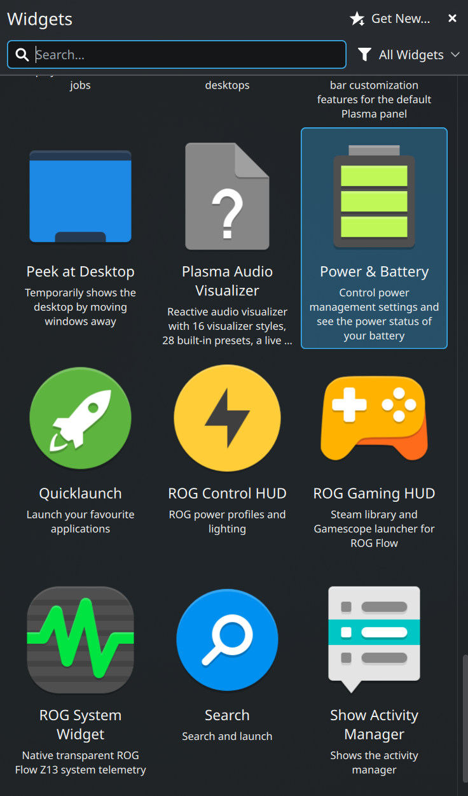

### Install a downloaded widget ZIP

Each original standalone widget ZIP includes its own `install.sh`. Download the widget, extract it, open a terminal in the extracted directory, and run:

```bash
bash install.sh
```

For example, after extracting the **ROG Gaming HUD v1.4** standalone ZIP into a folder named `rog-gaming-hud-v14` under Downloads:

```bash
cd ~/Downloads/rog-gaming-hud-v14
bash install.sh
```

If an updated widget still displays the old version, save your work and reload Plasma Shell:

```bash
systemctl --user restart plasma-plasmashell.service
```

This reload command is intended for the CachyOS KDE setup used to test these widgets; it is not normally necessary for a first-time install. It may briefly interrupt the desktop shell. **Do not run the widget installer with `sudo`.**

> **Note:** The four tested ZIP downloads are available in [GitHub Releases](../../releases/tag/v1.0.0). Developers can also build self-contained `.plasmoid` packages from the repository source.

### Available now: install from source

Requires Python 3.12+, Make, and `kpackagetool6`:

```bash
git clone https://github.com/jsmola01/rog-flow-kde-widgets.git
cd rog-flow-kde-widgets
make test
make install
```

Or install individually with `make install-system`, `make install-control`, or `make install-gaming`. No `sudo` is needed. Existing user-level widget packages are backed up before upgrades. See [installation and recovery](docs/installation.md).

## Install z13ctl first (required)

**These widgets rely on [z13ctl by dahui](https://github.com/dahui/z13ctl) for ROG Flow hardware integration.** On CachyOS (Arch-based), install its prebuilt AUR package:

```bash
yay -S z13ctl-bin
```

Follow the upstream [z13ctl installation guide](https://dahui.github.io/z13ctl/installation/) to complete its systemd/permission setup, then verify:

```bash
z13ctl status
z13ctl profile --list
```

For a graphical hardware-control app, [z13gui](https://github.com/dahui/z13gui) is an optional companion, **not required** for these widgets. The upstream author recommends it for users who prefer a GUI. These widgets do not install z13ctl, z13gui, or change system permissions automatically.

## Requirements

This project initially targets **CachyOS + KDE Plasma 6 + ASUS ROG Flow Z13**, rather than every Linux distribution or ROG model.

| Requirement | Used for |
| --- | --- |
| KDE Plasma 6, `kpackagetool6` | Installing and running the widgets |
| Python 3.12+ | System telemetry helper and source workflow |
| `z13ctl` installed on the Plasma session's `PATH` | Hardware telemetry, power profiles, and RGB |
| Steam | Local library and recently played information |
| `steamos-session-select gamescope` | Switching into an existing Gaming Mode session |
| BlueZ / `bluetoothctl` | Bluetooth controller connection and battery status |
| [**Bulky Pixels** font](https://www.1001fonts.com/bulky-pixels-font.html) | Download and install separately for the intended pixel-style appearance |

Gamescope and Steam must already be configured independently. Download [Bulky Pixels by Smoking Drum](https://www.1001fonts.com/bulky-pixels-font.html), install the TTF using KDE Font Management, then reopen the widgets if necessary. The font is not bundled.

The installer installs the widgets for the current signed-in desktop user. Steam libraries are discovered automatically from Steam's local configuration.

## System HUD

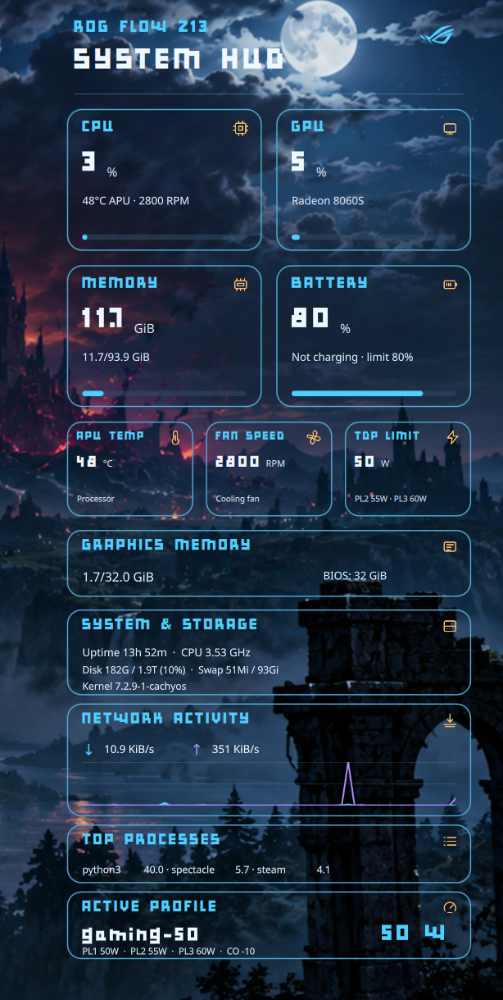

Monitor your ROG Flow's utilization, battery, cooling, power limits, graphics memory, storage, network traffic and active profile without opening a terminal. Choose a coordinated color theme, adjust glass transparency, and select Full or Semi-Compact display.

## Control HUD

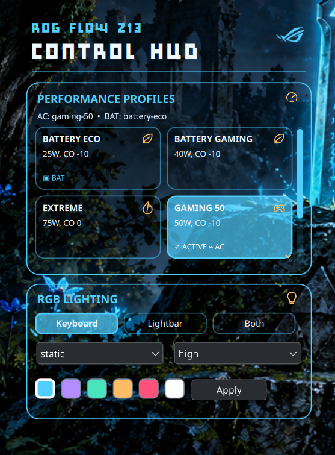

Switch between firmware and custom `z13ctl` profiles, including profiles named for gaming, battery use, or extreme performance. The current profile is highlighted. The profile list scrolls when necessary and firmware modes can be hidden. Keyboard and lightbar lighting can be controlled independently.

**Changing a profile or lighting setting changes the actual hardware configuration.**

## Gaming HUD

**Full view**

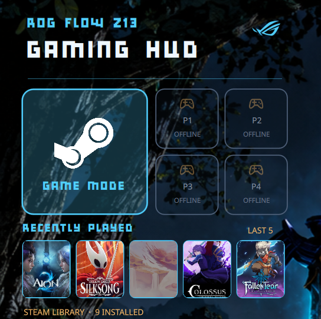

**Compact view**

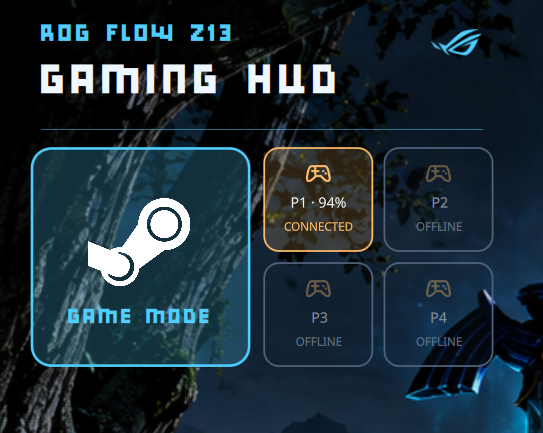

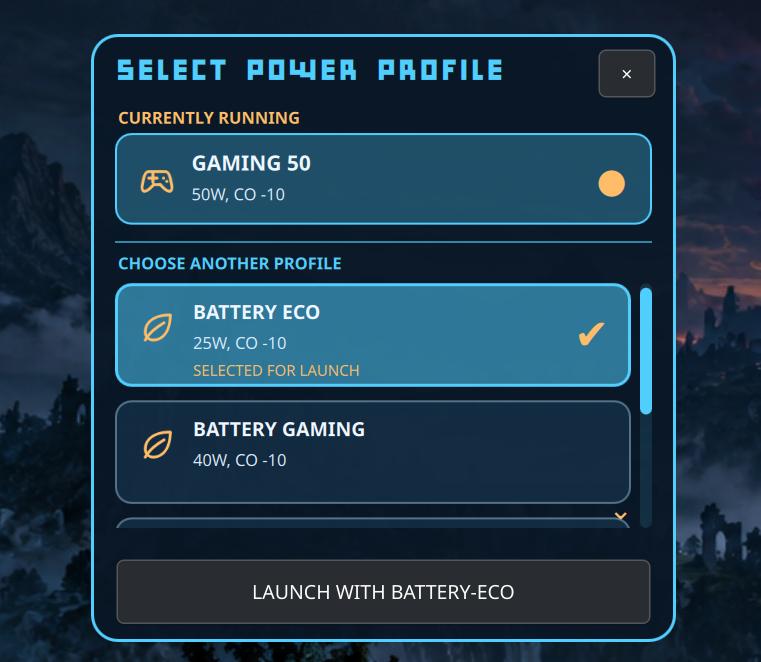

A square **Game Mode** card opens a frameless power-profile selector. It distinguishes **currently running** from **selected for launch**, so you can choose a profile before entering Gamescope. The HUD also shows up to four Bluetooth controllers and their reported battery levels.

Choose **Full**, **Semi-Compact**, or **Compact**:

- **Full:** header, launch card, controllers, recent games and installed-game count
- **Semi-Compact:** header, launch card and controllers
- **Compact:** launch card and controllers only

**Save your work before launching Gaming Mode:** session switching may close your desktop session.

> **Steam library behavior:** Gaming HUD filters known Steam tools and runtimes, reads recent-played activity from local Steam metadata, and loads locally cached artwork where available. Some games may lack cached cover art, and Steam library layouts may vary.

## Optional z13ctl power profiles

The widgets automatically display custom profiles configured in `z13ctl`. For owners who want to recreate the power profiles used in the screenshots, here is the suggested configuration. **These profiles are not bundled or installed by v1.0.0.** They are optional, and existing profiles should not be overwritten without reviewing their settings.

| Profile | `z13ctl` name | Sustained TDP (PL1) | CPU Curve Optimizer |
| --- | --- | ---: | ---: |
| 🌿 Battery Eco | `battery-eco` | 25W | -10 |
| 🎮 Battery Gaming | `battery-gaming` | 40W | -10 |
| 🎮 Gaming 50 | `gaming-50` | 50W | -10 |
| ⚡ Gaming 65 | `gaming-65` | 65W | -10 |
| 🔥 Extreme Gaming 75 | `extreme-gaming-75` | 75W | 0 |
| 🔥 Extreme Gaming 80 | `extreme-gaming-80` | 80W | 0 |

The widget's icon classifier prioritizes **Extreme** over **Gaming**, so both `extreme-gaming-*` profiles display the Extreme icon. Profiles with `battery` or `eco` in their names use the Eco icon.

### Create the optional profiles

After installing and configuring [z13ctl](https://github.com/dahui/z13ctl), use the following commands **only for profiles you want to create**. The `--profile` flag stores settings without immediately applying them to the running profile.

```bash
z13ctl profile --create battery-eco
z13ctl tdp --set 25 --profile battery-eco
z13ctl undervolt --set -10 --profile battery-eco

z13ctl profile --create battery-gaming
z13ctl tdp --set 40 --profile battery-gaming
z13ctl undervolt --set -10 --profile battery-gaming

z13ctl profile --create gaming-50
z13ctl tdp --set 50 --profile gaming-50
z13ctl undervolt --set -10 --profile gaming-50

z13ctl profile --create gaming-65
z13ctl tdp --set 65 --profile gaming-65
z13ctl undervolt --set -10 --profile gaming-65

z13ctl profile --create extreme-gaming-75
z13ctl tdp --set 75 --profile extreme-gaming-75
z13ctl undervolt --set 0 --profile extreme-gaming-75
```

**80W sustained profile:** The Z13 can operate at this power level, but `z13ctl` requires `--force` above 75W and a verified fan-curve safeguard. Before creating or applying this profile, consult [z13ctl's power-limit and daemon documentation](https://dahui.github.io/z13ctl/commands/) for the version you installed. Do not assume Windows Armoury Crate's fan behavior carries over to Linux. Create the profile only when the installed CLI supports storing a forced 80W setting safely.

To check which profiles exist and which one is active:

```bash
z13ctl profile --list
z13ctl tdp --get
z13ctl undervolt --get
```

Power limits and undervolts affect hardware behavior. Stability and cooling depend on your firmware, system configuration, and workload. The recommended values are examples from the project's Z13 setup, not guaranteed results for every machine.

## Personalize the look

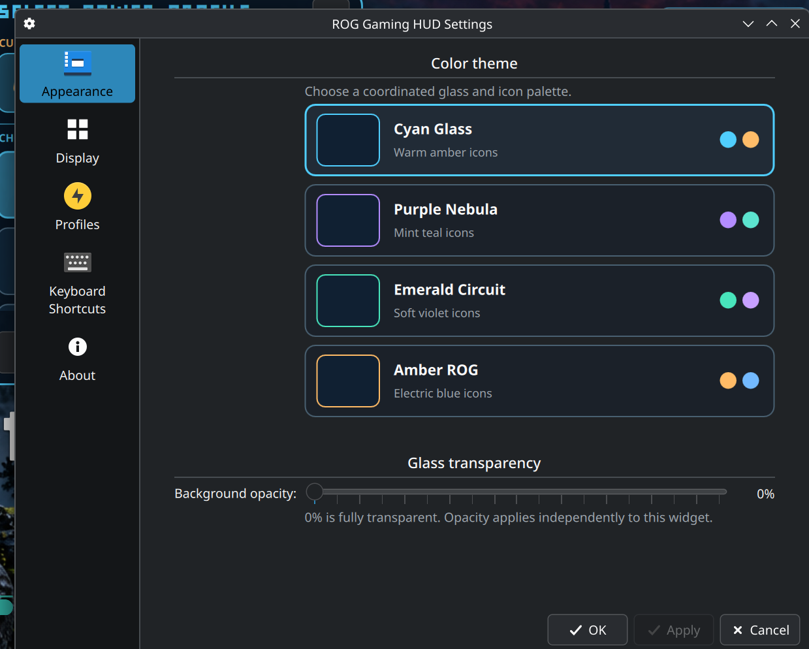

<details>
<summary>More configuration screenshots</summary>

**Gaming display modes**

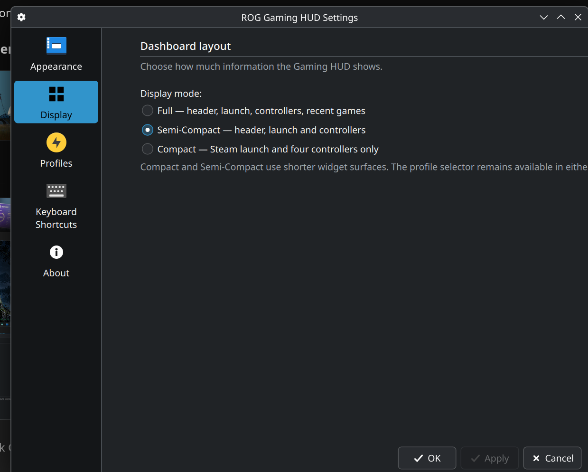

**Profile visibility**

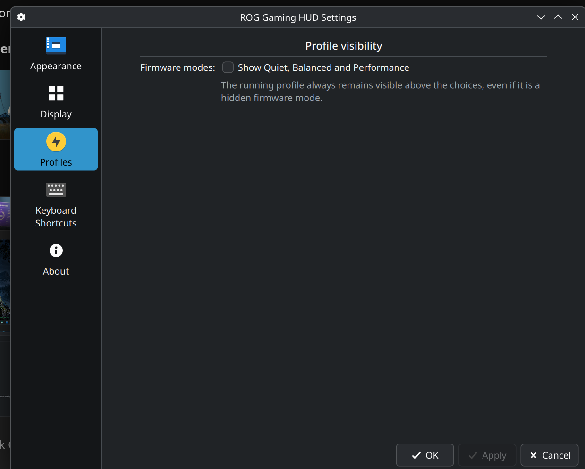

</details>

All three widgets use the same four palettes:

| Theme | Accent | Complementary icons |
| --- | --- | --- |
| Cyan Glass | Cyan | Warm amber |
| Purple Nebula | Purple | Mint teal |
| Emerald Circuit | Emerald | Soft violet |
| Amber ROG | Amber | Electric blue |

Each widget independently supports glass opacity. Open **Configure Widget → Appearance** to choose a theme and transparency; use **Display** and **Profiles** where available for layout and visibility settings.

## Troubleshooting and development

- [Installation, upgrades and rollback](docs/installation.md)
- [Configuration and behavior](docs/configuration.md)
- [Compatibility and dependency details](docs/compatibility.md)
- [Troubleshooting](docs/troubleshooting.md)
- [Review handoff and known issues](docs/review-handoff.md)

Developers can build standalone packages with `make build`, or individually with `make build-system`, `make build-control`, and `make build-gaming`. Generated `.plasmoid` files appear in `dist/`. Historical development ZIP baselines are retained under `baselines/`; use the tested [v1.0.0 release downloads](../../releases/tag/v1.0.0) for installation.

## Credits and license

Project code is [MIT licensed](LICENSE). Third-party icons, trademarks, and fonts retain their own rights; see [third-party notices](THIRD_PARTY_NOTICES.md). ASUS ROG and Steam marks belong to their respective owners.

**Made for the ROG Flow Z13 community.** Contributions, bug reports, and forks are welcome.
